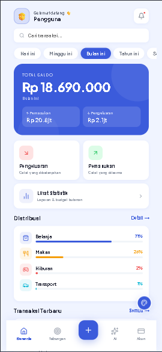
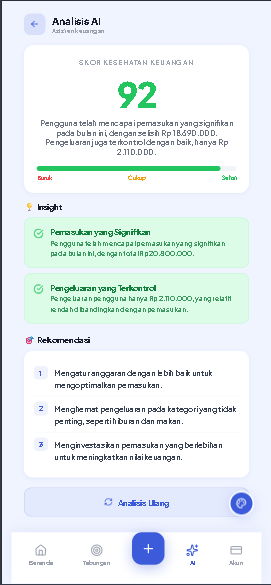

# 💰 DhuwitLog

> Aplikasi finance tracker modern dengan AI Analysis, dibangun dengan React + Vite


## 🌐 Live Demo

**[dhuwit-log.vercel.app](https://dhuwit-log.vercel.app)**

## ✨ Fitur

- 📊 **Dashboard** — ringkasan saldo, pemasukan & pengeluaran real-time
- 💸 **Expense & Income Tracking** — catat transaksi dengan kategori & tanggal custom
- 🏦 **Multi Akun** — kelola Tunai, Bank, E-wallet dalam satu app
- 📈 **Statistik** — grafik 7 hari, 30 hari, bulan ini, atau interval custom
- 🎯 **Target Tabungan** — set goal dengan deadline & tracking progress
- 🤖 **AI Analysis** — analisis keuangan otomatis powered by Groq AI (Llama 3)
- 🏷️ **Kategori Custom** — tambah kategori sendiri dengan Lucide icon picker
- ✏️ **Edit Transaksi** — ubah atau hapus transaksi yang sudah dicatat
- 🎨 **Custom Tema** — 6 pilihan warna tema
- 🌙 **Dark Mode** — toggle light/dark mode
- 📱 **PWA Ready** — bisa diinstall di HP seperti app native
- 💾 **Persistent Storage** — data tersimpan di localStorage

## 🛠️ Tech Stack

| Teknologi    | Kegunaan              |
| ------------ | --------------------- |
| React 18     | UI Framework          |
| Vite         | Build Tool            |
| Zustand      | State Management      |
| Recharts     | Data Visualization    |
| Lucide React | Icon Library          |
| Groq AI API  | AI Analysis (Llama 3) |
| Vercel       | Hosting & Serverless  |

## 📁 Struktur Project

```
src/
├── components/
│   ├── BottomNav.jsx
│   ├── ColorPicker.jsx
│   ├── ConfirmDialog.jsx
│   ├── EditTransactionModal.jsx
│   ├── HeroCard.jsx
│   ├── Modal.jsx
│   └── TransactionItem.jsx
├── pages/
│   ├── Home.jsx
│   ├── Stats.jsx
│   ├── Transactions.jsx
│   ├── Accounts.jsx
│   ├── Savings.jsx
│   └── AIAnalysis.jsx
├── store/
│   └── useStore.js
└── data/
    └── categories.js
```

## 🚀 Cara Menjalankan

```bash
# Clone repo
git clone https://github.com/USERNAME/DhuwitLog.git
cd DhuwitLog

# Install dependencies
npm install --legacy-peer-deps

# Jalankan development server
npm run dev

# Build untuk production
npm run build
```

## 🔧 Environment Variables

Buat file `.env` di root project:

```
GROQ_API_KEY=your_groq_api_key
```

Untuk Vercel, tambahkan di Settings → Environment Variables.

## 📸 Screenshots

| Home                            | Statistik                         | AI Analysis                 |
| ------------------------------- | --------------------------------- | --------------------------- |
|  |  |  |

## 👨‍💻 Developer

**Wahyu Arif** — [github.com/wahyuarif](https://github.com/wahyuarif)

---

⭐ Jangan lupa kasih star kalau project ini membantu!

```

---

**2. Buat file `.env.example`** di root:
```

# Groq AI API Key - daftar gratis di console.groq.com

GROQ_API_KEY=your_groq_api_key_here

```

---

**3. Buat file `.gitignore`** — pastikan ada:
```

node_modules
dist
.env
.env.local
